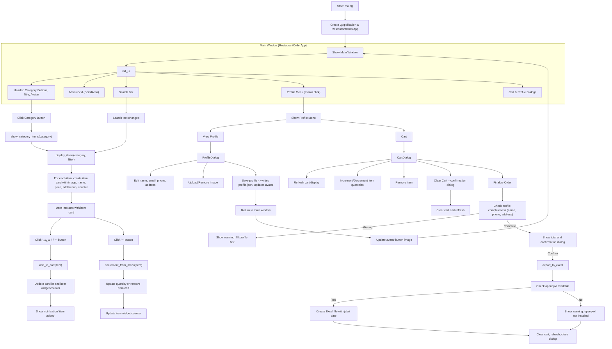

```mermaid
graph TD

	A["Start: main()"] --> B["Create QApplication & RestaurantOrderApp"]
	
	B --> C["Show Main Window"]
	
	  
	
	subgraph "Main Window (RestaurantOrderApp)"
	
	C --> D["init_ui"]
	
	D --> E["Header: Category Buttons, Title, Avatar"]
	
	D --> F["Menu Grid (ScrollArea)"]
	
	D --> G["Search Bar"]
	
	D --> H["Profile Menu (avatar click)"]
	
	D --> I["Cart & Profile Dialogs"]
	
	end
	
	  
	
	E --> J["Click Category Button"]
	
	J --> K["show_category_items(category)"]
	
	K --> L["display_items(category, filter)"]
	
	  
	
	G --> M["Search text changed"]
	
	M --> L
	
	  
	
	L --> N["For each item, create item card with image, name, price, add button, counter"]
	
	N --> O["User interacts with item card"]
	
	  
	
	O --> P["Click 'افزودن' / '+' button"]
	
	P --> Q["add_to_cart(item)"]
	
	Q --> R["Update cart list and item widget counter"]
	
	R --> S["Show notification 'item added'"]
	
	  
	
	O --> T["Click '−' button"]
	
	T --> U["decrement_from_menu(item)"]
	
	U --> V["Update quantity or remove from cart"]
	
	V --> W["Update item widget counter"]
	
	  
	
	H --> X["Show Profile Menu"]
	
	X --> Y["View Profile"]
	
	X --> Z["Cart"]
	
	  
	
	Y --> AA["ProfileDialog"]
	
	AA --> AB["Edit name, email, phone, address"]
	
	AA --> AC["Upload/Remove image"]
	
	AA --> AD["Save profile -> writes profile.json, updates avatar"]
	
	AD --> AE["Return to main window"]
	
	  
	
	Z --> AF["CartDialog"]
	
	AF --> AG["Refresh cart display"]
	
	AF --> AH["Increment/Decrement item quantities"]
	
	AF --> AI["Remove item"]
	
	AF --> AJ["Clear Cart – confirmation dialog"]
	
	AJ --> AK["Clear cart and refresh"]
	
	  
	
	AF --> AL["Finalize Order"]
	
	AL --> AM["Check profile completeness (name, phone, address)"]
	
	AM -->|Missing| AN["Show warning: fill profile first"]
	
	AM -->|Complete| AO["Show total and confirmation dialog"]
	
	AO -->|Confirm| AP["export_to_excel"]
	
	AP --> AQ["Check openpyxl available"]
	
	AQ -->|Yes| AR["Create Excel file with jalali date"]
	
	AQ -->|No| AS["Show warning: openpyxl not installed"]
	
	AR --> AT["Clear cart, refresh, close dialog"]
	
	AS --> AT
	
	  
	
	AE --> AU["Update avatar button image"]
	
	AU --> C
```

