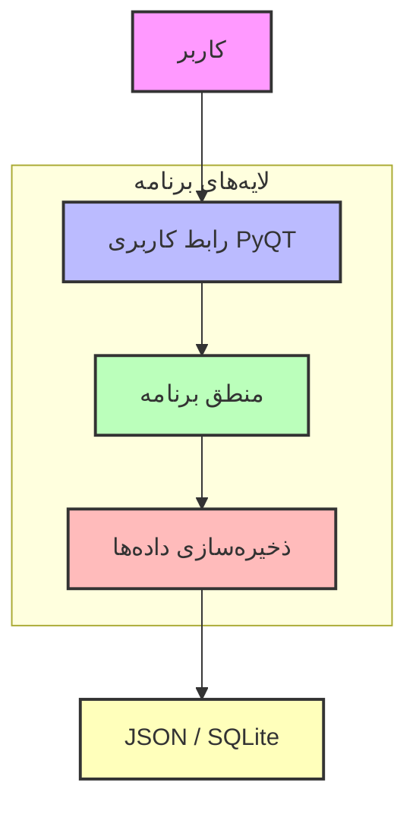
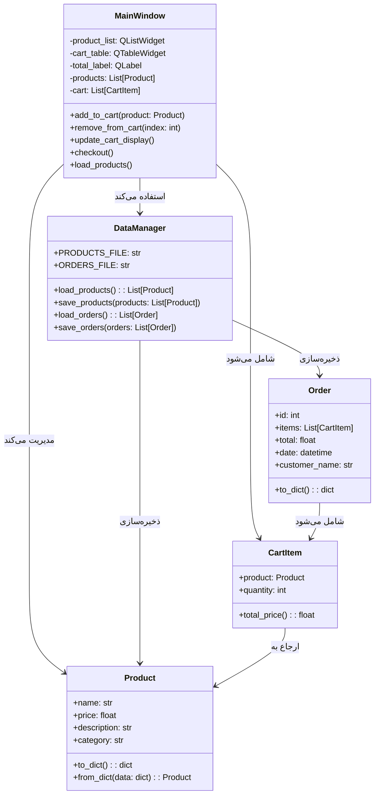
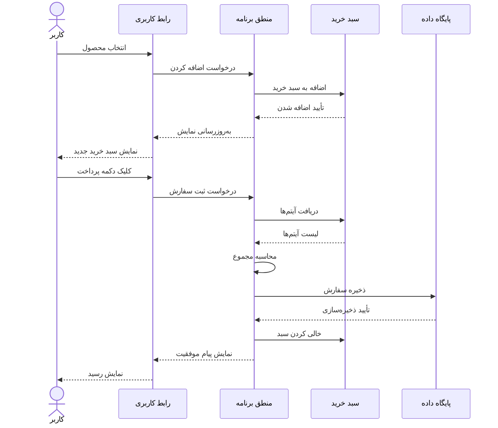
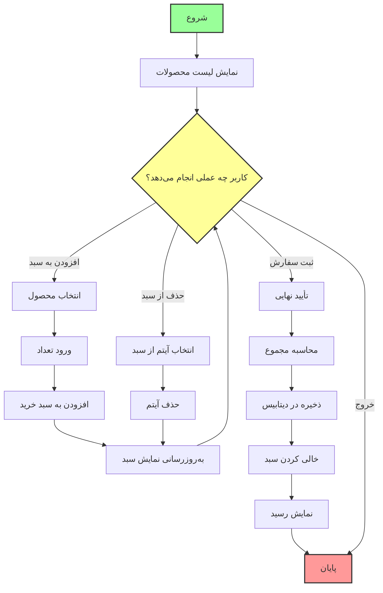
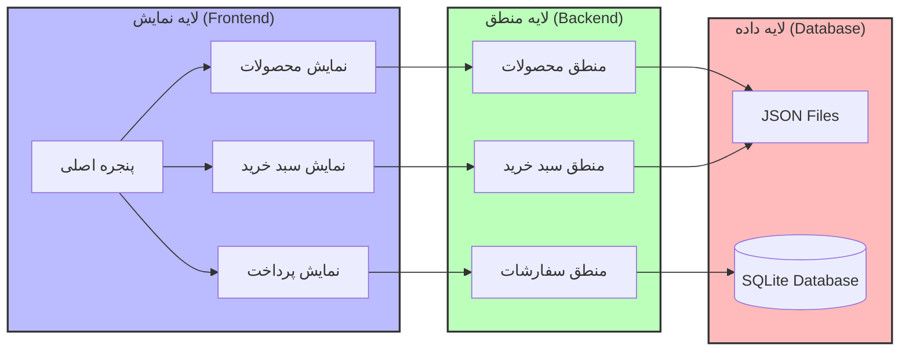
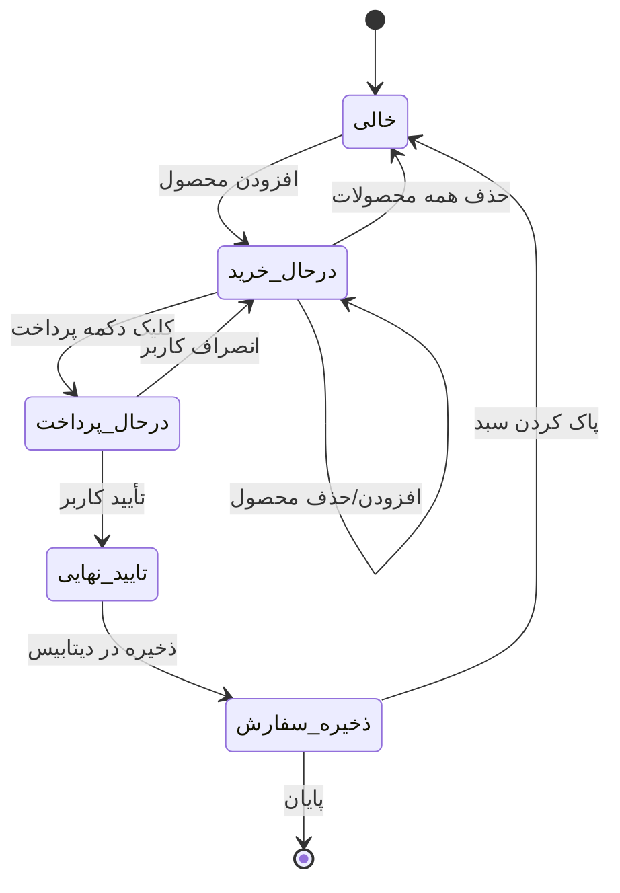
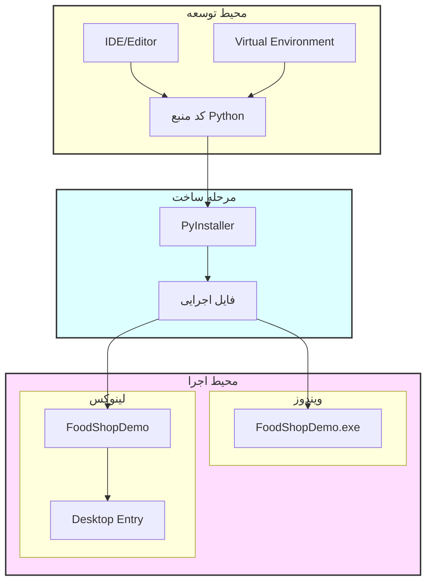

General diagram of system

```mermaid
graph TD
	A[کاربر] --> B[رابط کاربری PyQT]
	B --> C[منطق برنامه]
	C --> D[ذخیره‌سازی داده‌ها]
	D --> E[JSON / SQLite]
	
	subgraph "لایه‌های برنامه"
		B
		C
		D
	end
	
	style A fill:#f9f,stroke:#333,stroke-width:2px
	style B fill:#bbf,stroke:#333,stroke-width:2px
	style C fill:#bfb,stroke:#333,stroke-width:2px
	style D fill:#fbb,stroke:#333,stroke-width:2px
	style E fill:#ffb,stroke:#333,stroke-width:2px
```

Class Diagram 

```mermaid
classDiagram
    class MainWindow {
        -product_list: QListWidget
        -cart_table: QTableWidget
        -total_label: QLabel
        -products: List[Product]
        -cart: List[CartItem]
        +add_to_cart(product: Product)
        +remove_from_cart(index: int)
        +update_cart_display()
        +checkout()
        +load_products()
    }
    
    class Product {
        +name: str
        +price: float
        +description: str
        +category: str
        +to_dict(): dict
        +from_dict(data: dict): Product
    }
    
    class CartItem {
        +product: Product
        +quantity: int
        +total_price(): float
    }
    
    class DataManager {
        +PRODUCTS_FILE: str
        +ORDERS_FILE: str
        +load_products(): List[Product]
        +save_products(products: List[Product])
        +load_orders(): List[Order]
        +save_orders(orders: List[Order])
    }
    
    class Order {
        +id: int
        +items: List[CartItem]
        +total: float
        +date: datetime
        +customer_name: str
        +to_dict(): dict
    }
    
    MainWindow --> Product : مدیریت می‌کند
    MainWindow --> CartItem : شامل می‌شود
    MainWindow --> DataManager : استفاده می‌کند
    DataManager --> Product : ذخیره‌سازی
    DataManager --> Order : ذخیره‌سازی
    CartItem --> Product : ارجاع به
    Order --> CartItem : شامل می‌شود
```

Sequence Diagram

```mermaid
sequenceDiagram
    actor کاربر
    participant UI as رابط کاربری
    participant Logic as منطق برنامه
    participant Cart as سبد خرید
    participant DB as پایگاه داده
    
    کاربر->>UI: انتخاب محصول
    UI->>Logic: درخواست اضافه کردن
    Logic->>Cart: اضافه به سبد خرید
    Cart-->>Logic: تأیید اضافه شدن
    Logic-->>UI: به‌روزرسانی نمایش
    UI-->>کاربر: نمایش سبد خرید جدید
    
    کاربر->>UI: کلیک دکمه پرداخت
    UI->>Logic: درخواست ثبت سفارش
    Logic->>Cart: دریافت آیتم‌ها
    Cart-->>Logic: لیست آیتم‌ها
    Logic->>Logic: محاسبه مجموع
    Logic->>DB: ذخیره سفارش
    DB-->>Logic: تأیید ذخیره‌سازی
    Logic->>Cart: خالی کردن سبد
    Logic-->>UI: نمایش پیام موفقیت
    UI-->>کاربر: نمایش رسید
```

Activity Diagram 

```mermaid
flowchart TD
    A[شروع] --> B[نمایش لیست محصولات]
    B --> C{کاربر چه عملی انجام می‌دهد؟}
    
    C -->|افزودن به سبد| D[انتخاب محصول]
    D --> E[ورود تعداد]
    E --> F[افزودن به سبد خرید]
    F --> G[به‌روزرسانی نمایش سبد]
    G --> C
    
    C -->|حذف از سبد| H[انتخاب آیتم از سبد]
    H --> I[حذف آیتم]
    I --> G
    
    C -->|ثبت سفارش| J[تأیید نهایی]
    J --> K[محاسبه مجموع]
    K --> L[ذخیره در دیتابیس]
    L --> M[خالی کردن سبد]
    M --> N[نمایش رسید]
    N --> O[پایان]
    
    C -->|خروج| O
    
    style A fill:#9f9,stroke:#333,stroke-width:2px
    style O fill:#f99,stroke:#333,stroke-width:2px
    style C fill:#ff9,stroke:#333,stroke-width:2px
```

Component Diagram

```mermaid
graph LR
    subgraph Frontend["لایه نمایش (Frontend)"]
        MainWindow[پنجره اصلی]
        ProductView[نمایش محصولات]
        CartView[نمایش سبد خرید]
        CheckoutView[نمایش پرداخت]
    end
    
    subgraph Backend["لایه منطق (Backend)"]
        ProductLogic[منطق محصولات]
        CartLogic[منطق سبد خرید]
        OrderLogic[منطق سفارشات]
    end
    
    subgraph Database["لایه داده (Database)"]
        JSON[JSON Files]
        SQLite[(SQLite Database)]
    end
    
    MainWindow --> ProductView
    MainWindow --> CartView
    MainWindow --> CheckoutView
    
    ProductView --> ProductLogic
    CartView --> CartLogic
    CheckoutView --> OrderLogic
    
    ProductLogic --> JSON
    CartLogic --> JSON
    OrderLogic --> SQLite
    
    style Frontend fill:#bbf,stroke:#333,stroke-width:2px
    style Backend fill:#bfb,stroke:#333,stroke-width:2px
    style Database fill:#fbb,stroke:#333,stroke-width:2px
```

State Diagram 

```mermaid
stateDiagram-v2
    [*] --> خالی
    خالی --> درحال_خرید: افزودن محصول
    درحال_خرید --> خالی: حذف همه محصولات
    درحال_خرید --> درحال_خرید: افزودن/حذف محصول
    درحال_خرید --> درحال_پرداخت: کلیک دکمه پرداخت
    درحال_پرداخت --> تایید_نهایی: تأیید کاربر
    درحال_پرداخت --> درحال_خرید: انصراف کاربر
    تایید_نهایی --> ذخیره_سفارش: ذخیره در دیتابیس
    ذخیره_سفارش --> خالی: پاک کردن سبد
    ذخیره_سفارش --> [*]: پایان
```

Deployment Diagram

```mermaid
graph TD
    subgraph Development["محیط توسعه"]
        Dev[کد منبع Python]
        IDE[IDE/Editor]
        Venv[Virtual Environment]
    end
    
    subgraph Build["مرحله ساخت"]
        PyInstaller[PyInstaller]
        EXE[فایل اجرایی]
    end
    
    subgraph Production["محیط اجرا"]
        subgraph Windows["ویندوز"]
            WinEXE[FoodShopDemo.exe]
        end
        subgraph Linux["لینوکس"]
            LinEXE[FoodShopDemo]
            DesktopFile[Desktop Entry]
        end
    end
    
    Dev --> PyInstaller
    IDE --> Dev
    Venv --> Dev
    PyInstaller --> EXE
    EXE --> WinEXE
    EXE --> LinEXE
    LinEXE --> DesktopFile
    
    style Development fill:#ffd,stroke:#333,stroke-width:2px
    style Build fill:#dff,stroke:#333,stroke-width:2px
    style Production fill:#fdf,stroke:#333,stroke-width:2px
```

